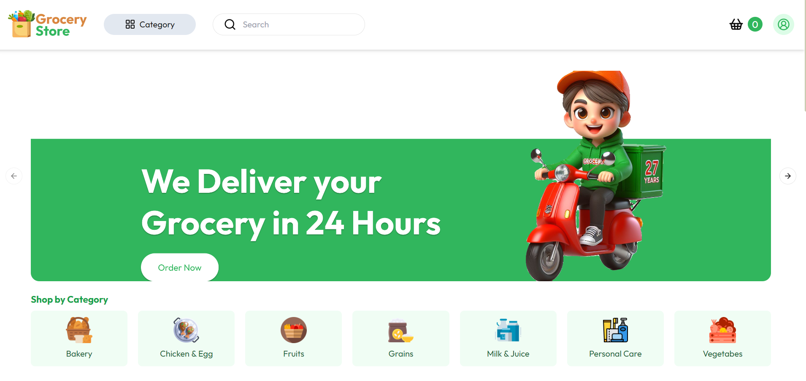

<h1 align="center">Grocery Store</h1>

Este é um projeto aberto. Confira a seguir informações relevantes sobre ele. 

  <a href="#-tecnologias">Tecnologias</a>&nbsp;&nbsp;&nbsp;|&nbsp;&nbsp;&nbsp;
  <a href="#-bibliotecas">Bibliotecas</a>&nbsp;&nbsp;&nbsp;|&nbsp;&nbsp;&nbsp;
  <a href="#-projeto">Projeto</a>&nbsp;&nbsp;&nbsp;|&nbsp;&nbsp;&nbsp;
  <a href="#memo-licença">Licença</a>

  

 

  

## 🚀 Tecnologias

Esse projeto foi desenvolvido com as seguintes tecnologias:

- React.js
- Next.js v14
- Tailwind css
- PostgreSql

## 📚 Bibliotecas

- Axios
- Shadcn
- Lucide React
- Sonner
- Moment
- PayPal

## 💻 Projeto

Uma mercearia online muito bonita e interativa. É possível criar uma conta, realizar login, filtrar produtos por categoria, adicionar e remover produtos do carrinho, simular o pagamento e visualizar o pedido. Um fluxo completo de e-commerce que põe em prática conceitos de componentização, server actions, responsividade e clean code. A grande sacada deste projeto foi utilizar o CMS Strapi para construir a API. Em poucos minutos toda a estrutura já estava montada e só bastou ir adicionando os conteúdos.

Para simular uma compra, utilize os seguintes dados de teste para fazer login no PayPal:

email: sb-ajr2d30682187@personal.example.com
senha: 0P>1gD:L

- [Acesse o projeto finalizado, online](https://grocery-store-jade.vercel.app)

- [Repositório API](https://github.com/RodrigoSerrasqueiro/grocery-store-api)

## :memo: Licença

Esse projeto está sob a licença MIT.

---

Desenvolvido por: Rodrigo Serrasqueiro [Dê uma olhada no meu portfólio!](https://rodrigoserrasqueiro.github.io/Portfolio)
